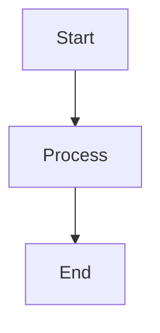

# Clean Hugo Theme

**A minimalistic Hugo theme that puts your content first.**

Clean is a modern, responsive Hugo theme designed for writers, developers, and content creators who value simplicity and readability. Built with performance and accessibility in mind, it delivers a distraction-free reading experience while maintaining elegant typography and thoughtful design.

🔗 **[Live Demo](https://eightpigs.io)** | 📖 **[Documentation](#configuration)**

---

## ✨ Features

### 🎨 **Clean & Minimal Design**
- Pure HTML + CSS architecture (no framework bloat)
- Typography-focused layout optimized for reading
- Automatic dark/light mode based on system preferences
- Responsive design that looks great on all devices

### ⚡ **Performance First**
- Minimal JavaScript footprint (only loads when needed)
- Modern CSS with custom properties (CSS variables)
- Optimized build process with Hugo's latest features
- Fast loading times and excellent Core Web Vitals scores

### 🛠 **Developer Friendly**
- Semantic HTML5 structure
- Accessible design with ARIA labels and skip links
- Easy customization through CSS variables

### 📊 **Rich Content Support**
- **Mathematics**: MathJax 3.x for beautiful mathematical notation
- **Diagrams**: Mermaid 10.x with automatic theme switching
- **Flowcharts**: Flowchart.js for process diagrams
- **Code Highlighting**: Syntax highlighting with customizable themes
- **Markdown Extensions**: Tables, task lists, strikethrough, and more

### 🌐 **International Ready**
- Multi-language support
- Proper semantic structure for screen readers
- Configurable category aliases for different languages
- RSS feeds and sitemap generation

---

## 🚀 Quick Start

### 1. Install the Theme

Add Clean as a Git submodule to your Hugo site:

```bash
git submodule add https://github.com/eightpigs/hugo-clean.git themes/clean
```

Or download and extract the theme manually:

```bash
git clone https://github.com/eightpigs/hugo-clean.git themes/clean
```

### 2. Configure Your Site

Update your `hugo.toml` (or `config.yaml`) file:

```toml
theme = "clean"

[params]
  description = "Your site description"
  author = "Your Name"
  
  # Enable features as needed
  [params.render]
    mathjax = true    # Enable math rendering
    mermaid = true    # Enable diagrams
    flowchart = true  # Enable flowcharts
```

### 3. Create Content

Create your first post:

```bash
hugo new posts/my-first-post.md
```

Add front matter to enable special features:

```yaml
---
title: "My Post with Math"
date: 2024-01-01
formula: true    # Enable MathJax for this post
graphic: true    # Enable Mermaid diagrams
flowchart: true  # Enable flowcharts
---
```

---

## ⚙️ Configuration

### Basic Configuration

```toml
baseURL = 'https://yourdomain.com'
languageCode = 'en'
title = 'Your Site Title'
theme = "clean"

[params]
  description = "A brief description of your site"
  keywords = "hugo, blog, clean, minimal"
  author = "Your Name"
  
  # Navigation menu
  [[menus.main]]
    identifier = "home"
    name = "Home"
    url = "/"
    weight = 10
  
  [[menus.main]]
    identifier = "articles"
    name = "Articles"
    url = "/articles"
    weight = 20
```

### Advanced Features

```toml
[params]
  # Social links (optional)
  [params.socials]
    enable = true
    github = "yourusername"
    twitter = "yourusername"
    email = "your@email.com"
  
  # Category aliases for international sites
  [params.category]
    inIndex = true
    [params.category.alias]
      tech = "Technology"
      dev = "Development"
      life = "Lifestyle"
  
  # Creative Commons license
  [params.cc]
    name = "by-nc-nd 4.0"
    url = "https://creativecommons.org/licenses/by-nc-nd/4.0/"
```

### Content Features

Enable special rendering in your posts:

```yaml
---
title: "Advanced Post"
formula: true     # Enables MathJax
graphic: true     # Enables Mermaid diagrams
flowchart: true   # Enables Flowchart.js
highlight: true   # Enables code highlighting
---

# Math Example
Inline math: $E = mc^2$

Block math:
$$\int_{-\infty}^{\infty} e^{-x^2} dx = \sqrt{\pi}$$

# Diagram Example

```

---

## 🎨 Customization

### CSS Variables

Clean uses CSS custom properties for easy theming:

```css
:root {
  --color-text: #212529;
  --color-bg: #ffffff;
  --color-accent: #d73a49;
  --font-serif: "Times New Roman", serif;
  --space-lg: 2rem;
}
```

### Custom Styles

Add your custom CSS in `assets/css/custom.css`:

```css
/* Your custom styles */
.my-custom-class {
  color: var(--color-accent);
}
```

---

## 📱 Browser Support

- **Modern Browsers**: Chrome 88+, Firefox 78+, Safari 14+, Edge 88+
- **CSS Features**: CSS Grid, Flexbox, Custom Properties
- **JavaScript**: ES6+ modules (optional features only)

---

## 📄 License

This theme is released under the [MIT License](LICENSE).

---

## 🙏 Acknowledgments

- Inspired by [hexo-theme-cactus](https://github.com/probberechts/hexo-theme-cactus)
- Built with [Hugo](https://gohugo.io/)
- Typography inspired by Medium and Ghost themes

---

**Made with ❤️ for the Hugo community**
