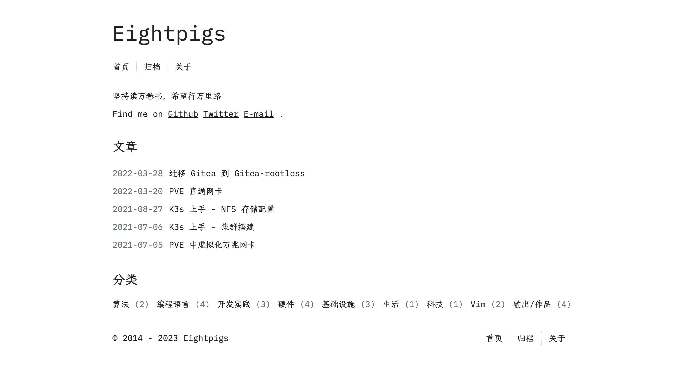

# Clean

A minimalistic Hugo theme crafted with simplicity, content-focus, and an exceptional reading experience in mind. Free from unnecessary JavaScript dependencies, Clean offers an uncluttered, distraction-free environment to showcase your blog's content.

- Demo: [DEMO](https://eightpigs.io)
- Inspired by [hexo-theme-cactus](https://github.com/probberechts/hexo-theme-cactus).

## Features

- Minimalistic design (HTML + CSS)
- JavaScript-free usage (except for MathJax, Mermaid, Flowchart, Highlight)
- Supports common rendering features:
  - [MathJax](https://github.com/mathjax/MathJax) for mathematical notation
  - [Mermaid](https://github.com/mermaid-js/mermaid) for diagrams and flowcharts
  - [Flowchart](https://github.com/adrai/flowchart.js) for generating flowcharts from text

## Installation

1. Install the theme in the root directory of your blog:
```bash
git submodule add git@github.com:eightpigs/hugo-clean.git themes/clean
```

2. Modify your blog's `config.yaml`:

Please refer to the [example config.yaml](./config.yaml) for guidance.

## Screenshots




